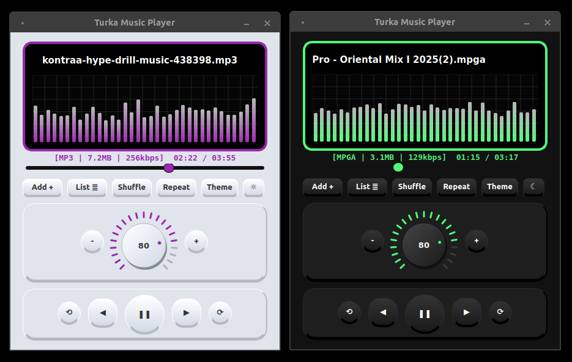
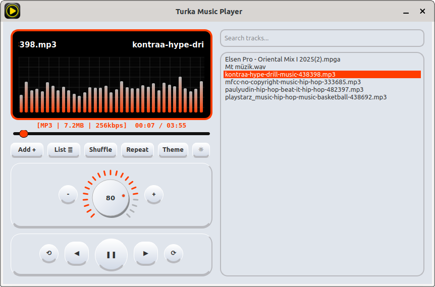

# Turka Music Player

A simple and lightweight music player application built with Python and Qt6.

Download link for the .deb file (Debian-based systems): https://github.com/03tekno/Turka-Music-Player/releases/tag/current

Turka Music Player: Feel the Music, Start the Visual Feast! 🎶

Tired of ordinary music players? Turka Music Player is a next-generation media player that combines minimalist design with professional audio visualization (VU Meter) technology, appealing to both your eyes and ears. Developed with the power of Python and PyQt6, this application transforms your music listening experience into desktop art.
Key Features

10 Different Visualization Modes: Switch between 10 different animation modes by simply clicking the dynamic spectrum panel. Experience the rhythm of your music in diverse ways—from classic bar charts and digital blocks to waveforms and symmetrical artistic patterns.

Professional Audio Control: Adjust your volume with precision using the analog-style "Pro Volume Knob."

Wide Format Support: Seamlessly play a broad range of audio formats including .mp3, .wav, .flac, .m4a, .mpga, .aac, .ogg, .opus, .wma, .m4b, .aiff, .mid, and .amr.

Modern and Adaptive Interface: Toggle between Dark and Light modes with a single click. Plus, customize your player to match your personality with over 20 special theme colors.

Smart Playlist Management: Manage your music library effortlessly with drag-and-drop support, an advanced search bar, and an auto-save feature. Even if you close the app, your playlist and preferences will be waiting for you when you return.

Why Turka Music Player?

Turka is not just a player; it’s a stylish accessory for your desktop. With smooth scrolling song titles, fluid animations, and user-friendly navigation buttons, the control of your music is entirely in your hands.

"Don’t just listen to the music—watch its rhythm with Turka."
