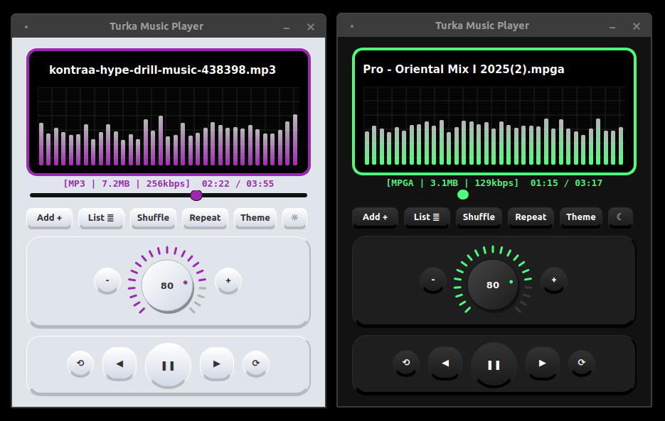
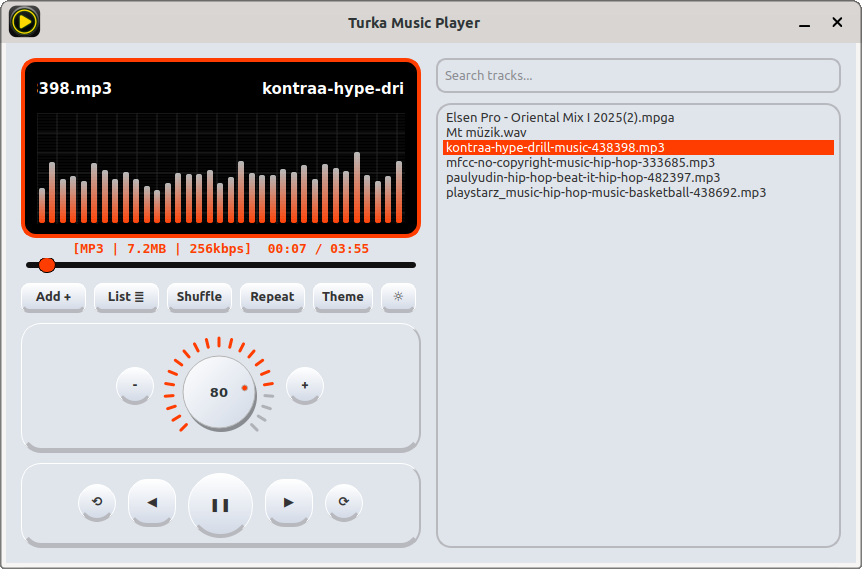

# Turka Music Player (English)

A user-friendly, modern, and lightweight music player application developed with Pyqt6.

Wide Format Support: Seamlessly play a broad range of audio formats including .mp3 .wav .flac .m4a .mpga .aac .ogg .opus .wma .m4b .aiff .mid .amr .au .snd .ac3 .voc .mka 

Download link for the .deb file (Debian-based systems): 

https://github.com/03tekno/Turka-Music-Player/releases/tag/v1.0

